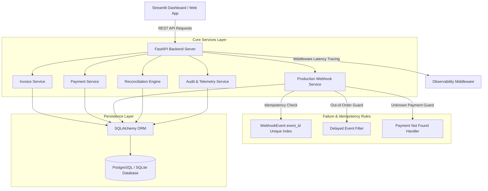

# 🩺 PulsePay — Healthcare Billing, Payments & Reconciliation Engine

> **Production-grade financial backend and real-time reconciliation platform designed for modern healthcare providers, payment gateways, and hospital billing systems.**

---

## 📌 Executive Summary

Healthcare payment processing involves complex workflows, insurance claims, third-party payment gateways (Razorpay, Stripe), and out-of-band settlements. In real-world environments, network glitches, out-of-order webhooks, duplicate webhook retries, and manual overrides create critical financial mismatches between gateway records and patient billing ledgers.

**PulsePay** is built to simulate and resolve real-world money movement failures in healthcare systems with strict emphasis on **Idempotency**, **Out-of-Order Webhook Protection**, **Automated Financial Reconciliation**, and **High-Observability Telemetry**.

---

## 🏗️ System Architecture



---

## 📁 Project Structure

```
pulsepay-healthcare-reconciliation/
│
├── app.py                             # Streamlit UI Dashboard (Supports REST & Embedded DB mode)
├── requirements.txt                   # Production dependencies
├── README.md                          # Comprehensive documentation & deployment guide
├── .env.example                       # Environment template
├── .gitignore                         # Python & SQLite exclusions
│
├── backend/                           # Modular FastAPI Application
│   ├── main.py                        # Application entrypoint, CORS, middleware, routers
│   ├── config.py                      # Pydantic Settings & DB configuration
│   │
│   ├── database/                      # DB Engine & Session Provider
│   │   ├── base.py                    # SQLAlchemy Base
│   │   ├── connection.py              # Engine setup (PostgreSQL / SQLite fallback)
│   │   └── session.py                 # get_db dependency provider
│   │
│   ├── models/                        # SQLAlchemy Database Schemas
│   │   ├── invoice.py                 # Invoice Table (id, patient_id, amount, status)
│   │   ├── payment.py                 # Payment Table (id, invoice_id, amount, status, provider)
│   │   ├── webhook.py                 # WebhookEvent Table (event_id UNIQUE index)
│   │   └── audit.py                   # AuditLog Table (event_type, entity_id, timestamp)
│   │
│   ├── schemas/                       # Pydantic Validation Models
│   │   ├── invoice_schema.py
│   │   ├── payment_schema.py
│   │   ├── webhook_schema.py
│   │   ├── reconciliation_schema.py
│   │   └── audit_schema.py
│   │
│   ├── services/                      # Business Logic Layer (Clean Architecture)
│   │   ├── invoice_service.py         # Invoice CRUD & detail builder
│   │   ├── payment_service.py         # Gateway initiation & payment retries
│   │   ├── webhook_service.py         # Idempotent webhook processor
│   │   ├── reconciliation_service.py  # 5-rule financial mismatch scanner & resolver
│   │   └── audit_service.py           # Immutable audit logging & metrics
│   │
│   ├── routes/                        # FastAPI Controllers (No Business Logic)
│   │   ├── invoice_routes.py          # /invoices API
│   │   ├── payment_routes.py          # /payments API
│   │   ├── webhook_routes.py          # /webhook/payment API
│   │   ├── reconciliation_routes.py   # /reconcile API
│   │   └── system_routes.py           # /metrics & /audit-logs API
│   │
│   └── utils/                         # Helpers & Utilities
│       ├── logger.py                  # Structured console logger
│       ├── middleware.py              # Request latency & tracing middleware
│       └── seed.py                    # Healthcare billing seed dataset
│
└── scripts/
    └── simulate_webhooks.py           # Webhook simulation testing script
```

---

## ⚡ Critical Failure & Edge Cases Handled

### 1. Webhook Idempotency (`POST /webhook/payment`)
- **Problem:** Payment gateways (Stripe/Razorpay) retry webhooks multiple times due to temporary network timeouts, causing duplicate status updates or over-crediting.
- **Solution:** PulsePay enforces strict idempotency by indexing unique `event_id` values in the `WebhookEvent` table. If a duplicate `event_id` arrives, it is caught immediately, logged as `WEBHOOK_DUPLICATE_IGNORED`, and returns an HTTP 200 response with `{"status": "ignored"}` without mutating invoice state.

### 2. Delayed & Out-of-Order Webhook Events
- **Problem:** A patient's payment succeeds (`SUCCESS`), but due to network congestion, an earlier failing webhook (`FAILED`) arrives *after* the success event.
- **Solution:** The `WebhookService` checks the current payment state. If the payment is already in status `SUCCESS`, incoming `FAILED` events are rejected (`DELAYED_IGNORED`), preserving the successful payment state.

### 3. Unknown Payment ID Safe Haven
- **Problem:** Webhooks referencing non-existent or malformed `payment_id` values can crash backend workers.
- **Solution:** PulsePay catches unknown `payment_id` payloads gracefully, logs the event under `PAYMENT_NOT_FOUND` in audit logs, and returns a clean response without throwing unhandled server exceptions.

### 4. Double Update Prevention & Atomic Database Transactions
- **Problem:** Simultaneous concurrent webhooks modifying invoice status can cause race conditions.
- **Solution:** Updates are executed inside isolated database sessions managed by SQLAlchemy, ensuring atomic state transitions.

---

## 🔍 Reconciliation Engine (`GET /reconcile`)

PulsePay automatically scans patient invoices and gateway transactions to detect **5 major financial risk categories**:

| Risk Category | Scenario | Severity | Automated Action |
| :--- | :--- | :--- | :--- |
| `PAID_WITHOUT_SUCCESS_PAYMENT` | Invoice marked `PAID` but no `SUCCESS` gateway payment exists | HIGH | Re-sync invoice to `PENDING` |
| `SUCCESS_PAYMENT_INVOICE_PENDING` | Payment status `SUCCESS` but Invoice remains `PENDING` | HIGH | Auto-update invoice to `PAID` |
| `MULTIPLE_SUCCESS_PAYMENTS` | Multiple successful payments for a single invoice (Overpayment) | CRITICAL | Flag for Gateway Refund |
| `UNRETRIED_FAILED_PAYMENT` | Invoice has failed payment attempts with no retry | MEDIUM | Trigger Automated Payment Retry |
| `AMOUNT_DISCREPANCY` | Total paid amount does not equal target invoice amount | MEDIUM | Flag balance adjustment required |

---

## 🚀 Setup & Execution Guide

### Option 1: Running Locally (FastAPI + Streamlit)

1. **Clone the Repository & Install Dependencies:**
   ```bash
   git clone https://github.com/Dhanya562004/pulsepay-healthcare-reconciliation.git
   cd pulsepay-healthcare-reconciliation
   pip install -r requirements.txt
   ```

2. **Start the FastAPI Backend Server:**
   ```bash
   uvicorn backend.main:app --reload --port 8000
   ```
   *Interactive Swagger API documentation available at:* `http://localhost:8000/docs`

3. **Start the Streamlit Dashboard UI:**
   ```bash
   streamlit run app.py
   ```
   *Dashboard opens at:* `http://localhost:8501`

---

### Option 2: Deployment on Streamlit Cloud

1. Push your repository to GitHub (`https://github.com/Dhanya562004/pulsepay-healthcare-reconciliation.git`).
2. Log into [Streamlit Cloud](https://share.streamlit.io/) and create a **New App**.
3. Select your repository, set the **Main file path** to `app.py`.
4. Add environment variables under **App Settings -> Secrets**:
   ```toml
   DATABASE_URL = "sqlite:///./pulsepay.db"
   ENVIRONMENT = "production"
   ```
5. Deploy! Streamlit Cloud will run `app.py` directly using the embedded direct DB engine fallback automatically.

---

## 🧪 Webhook Simulation Script

Run the automated simulation script to test all webhook edge cases against a running FastAPI backend:

```bash
python scripts/simulate_webhooks.py
```

---

## 📡 Example API Requests (cURL)

### 1. Create a Patient Invoice
```bash
curl -X POST "http://localhost:8000/invoices" \
     -H "Content-Type: application/json" \
     -d '{
           "patient_id": "PAT-90210",
           "patient_name": "Sarah Connor",
           "service_description": "Brain MRI Scan & Radiology",
           "amount": 1250.00
         }'
```

### 2. Initiate Payment Gateway Transaction
```bash
curl -X POST "http://localhost:8000/payments/create" \
     -H "Content-Type: application/json" \
     -d '{
           "invoice_id": "<INVOICE_UUID>",
           "amount": 1250.00,
           "provider": "razorpay"
         }'
```

### 3. Dispatch Payment Webhook (Idempotency Test)
```bash
curl -X POST "http://localhost:8000/webhook/payment" \
     -H "Content-Type: application/json" \
     -d '{
           "event_id": "evt_test_unique_998877",
           "payment_id": "<PAYMENT_UUID>",
           "status": "SUCCESS"
         }'
```

### 4. Run Financial Reconciliation Scan
```bash
curl -X GET "http://localhost:8000/reconcile"
```

### 5. Bulk Retry Failed Payments
```bash
curl -X POST "http://localhost:8000/payments/retry-all"
```

---

## 🛡️ License

Built for Production Healthcare Financial Systems. Released under the MIT License.
