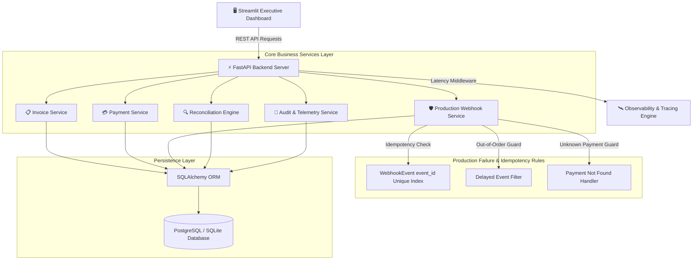

<div align="center">

# 🩺 PulsePay — Healthcare Billing, Payments & Reconciliation Engine

### *Production-Grade Financial Backend, Payment Gateway Integration & Real-Time Reconciliation System*

[](https://pulsepay-healthcare-reconciliation-fpyr9vynfto549zh8mwwhf.streamlit.app/)
[](https://fastapi.tiangolo.com/)
[](https://www.python.org/)
[](https://www.sqlalchemy.org/)
[](https://streamlit.io/)
[](LICENSE)

[**🌐 Launch Live Dashboard**](https://pulsepay-healthcare-reconciliation-fpyr9vynfto549zh8mwwhf.streamlit.app/) • [**📖 API Specs**](#-api-documentation--curl-examples) • [**⚡ Simulation Lab**](#-webhook-simulation-lab) • [**🚀 Local Deployment**](#-local-installation--quick-start)

---

</div>

## 📌 Executive Summary

Healthcare financial systems process millions of billing invoices daily across third-party payment gateways (Razorpay, Stripe) and hospital management platforms. In real-world production environments, **network timeouts, out-of-order webhooks, duplicate event retries, and manual overrides** lead to critical discrepancies between gateway settlement logs and patient ledgers.

**PulsePay** is a production-grade healthcare reconciliation engine built to simulate, track, and automatically resolve real-world monetary flow failures. It guarantees **Idempotency**, **Out-of-Order Webhook Protection**, **Sub-50ms Latency Observability**, and **5-Category Automated Financial Reconciliation**.

---

## ✨ Key Features & Technical Highlights

- 💳 **Healthcare Billing & Invoicing System:** UUID-indexed invoice creation, status tracking (`PENDING`, `PAID`, `FAILED`), and patient ledger history.
- 🔄 **Multi-Gateway Payment Integration:** Simulated payment gateway processor (Razorpay & Stripe mock) with failure simulation & manual retry mechanics.
- 🛡️ **Production-Grade Webhook Engine:**
  - **Strict Idempotency:** Indexed `event_id` checking prevents duplicate event re-processing.
  - **Out-of-Order & Delayed Event Guard:** Ignores delayed `FAILED` webhooks for already `SUCCESS` payments to prevent status corruption.
  - **Unknown Payment ID Safehaven:** Graceful fallback logging without throwing uncaught server exceptions.
  - **Double Update Prevention:** Atomic isolated database sessions.
- 🔍 **5-Rule Financial Reconciliation Engine:** Detects and auto-resolves revenue discrepancies (Overpayments, Unretried Failures, Missing Payments).
- 🛰️ **Observability & Request Latency Middleware:** Computes execution duration in `ms` and attaches `X-Process-Time` tracing headers.
- 🎨 **Modern Streamlit Executive Dashboard:** Glassmorphic UI with KPI cards, Plotly charts, interactive webhook laboratory, and audit log timelines.

---

## 🏗️ Architecture & Component Flow



---

## ⚡ Production Webhook Edge Cases & Idempotency Rules

Webhooks in financial systems are inherently unpredictable. PulsePay handles all real-world failure modes:

| Scenario | Challenge | PulsePay Production Solution | HTTP Status |
| :--- | :--- | :--- | :--- |
| **Duplicate Event Retries** | Gateway retries same `event_id` multiple times | Checked against `WebhookEvent.event_id` index; logged as `DUPLICATE_IGNORED` | `200 OK` (Ignored) |
| **Out-of-Order Events** | Delayed `FAILED` webhook arrives *after* payment achieved `SUCCESS` | Protects success state; logged as `DELAYED_IGNORED` | `200 OK` (Ignored) |
| **Unknown Payment ID** | Webhook payload references non-existent `payment_id` | Catches gracefully; logged as `PAYMENT_NOT_FOUND` without server crash | `200 OK` (Not Found) |
| **Concurrent Updates** | Simultaneous webhooks modifying invoice state | Atomic transaction isolation using SQLAlchemy session locks | `200 OK` (Processed) |

---

## 🔍 Reconciliation Engine & 5-Mismatch Detection

PulsePay scans all invoices and payment gateway records to flag **5 financial risk categories**:

```
 📊 FINANCIAL RECONCILIATION AUDIT
 ─────────────────────────────────────────────────────────────────────────────
 1. PAID_WITHOUT_SUCCESS_PAYMENT   [HIGH]     Invoice = PAID but no success payment
 2. SUCCESS_PAYMENT_INVOICE_PENDING[HIGH]     Payment = SUCCESS but Invoice = PENDING
 3. MULTIPLE_SUCCESS_PAYMENTS      [CRITICAL] Multiple payments for 1 invoice (Overpayment)
 4. UNRETRIED_FAILED_PAYMENT       [MEDIUM]   Failed payment attempts not retried
 5. AMOUNT_DISCREPANCY             [MEDIUM]   Paid amount != Invoice target amount
 ─────────────────────────────────────────────────────────────────────────────
```

---

## 📁 Repository Structure

```
pulsepay-healthcare-reconciliation/
│
├── app.py                             # Streamlit Dashboard (REST & Direct DB Fallback Mode)
├── requirements.txt                   # Production dependencies
├── README.md                          # Comprehensive documentation & deployment guide
├── .env.example                       # Environment settings template
├── .gitignore                         # Git exclusion rules
│
├── backend/                           # Modular FastAPI Application
│   ├── main.py                        # FastAPI entrypoint, CORS & Observability Middleware
│   ├── config.py                      # Settings & DB configuration
│   │
│   ├── database/                      # DB Engine & Session Provider
│   │   ├── base.py                    # SQLAlchemy Base
│   │   └── session.py                 # Engine setup (PostgreSQL / SQLite fallback)
│   │
│   ├── models/                        # SQLAlchemy ORM Models
│   │   ├── invoice.py                 # Invoice Table (id, patient_id, amount, status)
│   │   ├── payment.py                 # Payment Table (id, invoice_id, status, provider)
│   │   ├── webhook.py                 # WebhookEvent Table (event_id UNIQUE index)
│   │   └── audit.py                   # AuditLog Table (event_type, entity_id, timestamp)
│   │
│   ├── schemas/                       # Pydantic Schemas
│   │   ├── invoice_schema.py
│   │   ├── payment_schema.py
│   │   ├── webhook_schema.py
│   │   ├── reconciliation_schema.py
│   │   └── audit_schema.py
│   │
│   ├── services/                      # Business Logic Layer (Clean Architecture)
│   │   ├── invoice_service.py         # Invoice CRUD & detail builder
│   │   ├── payment_service.py         # Payment gateway initiation & retries
│   │   ├── webhook_service.py         # Idempotent webhook processor
│   │   ├── reconciliation_service.py  # 5-rule financial mismatch scanner & resolver
│   │   └── audit_service.py           # Immutable audit logging & metrics
│   │
│   ├── routes/                        # FastAPI Controllers (No Business Logic)
│   │   ├── invoice_routes.py          # /invoices API
│   │   ├── payment_routes.py          # /payments API
│   │   ├── webhook_routes.py          # /webhook/payment API
│   │   ├── reconciliation_routes.py   # /reconcile API
│   │   └── system_routes.py           # /metrics & /audit-logs API
│   │
│   └── utils/                         # Utilities & Middlewares
│       ├── logger.py                  # Structured console logger
│       ├── middleware.py              # Request latency & tracing middleware
│       └── seed.py                    # Healthcare billing seed dataset
│
└── scripts/
    └── simulate_webhooks.py           # CLI Webhook simulation script
```

---

## 🚀 Local Installation & Quick Start

### 1. Clone & Install Dependencies
```bash
git clone https://github.com/Dhanya562004/pulsepay-healthcare-reconciliation.git
cd pulsepay-healthcare-reconciliation
pip install -r requirements.txt
```

### 2. Launch FastAPI Backend Server
```bash
uvicorn backend.main:app --reload --port 8000
```
- **Interactive Swagger Docs:** `http://localhost:8000/docs`
- **ReDoc API Specs:** `http://localhost:8000/redoc`

### 3. Launch Streamlit UI Dashboard
```bash
streamlit run app.py
```
- **Dashboard URL:** `http://localhost:8501`

---

## 🧪 Webhook Simulation Lab

Run the automated simulation script to execute end-to-end tests against idempotency, out-of-order events, and reconciliation logic:

```bash
python scripts/simulate_webhooks.py
```

**Console Output:**
```
======================================================================
 [PULSEPAY] PULSEPAY WEBHOOK SIMULATION LAB
======================================================================
[OK] Connected to PulsePay Backend at http://localhost:8000
Created Invoice ID: 7c7a2c5c-b071-40da-bfc1-ec83c381790a | Status: PENDING
Created Payment ID: a707a814-cb32-459d-a6cb-ee1ea5be207d | Status: INITIATED
[OK] Webhook processed successfully. Invoice status updated to 'PAID'.
[OK] IDEMPOTENCY TEST PASSED! Duplicate event was correctly caught & ignored.
[OK] OUT-OF-ORDER PROTECTION PASSED! Successful payment status was preserved.
[OK] UNKNOWN PAYMENT TEST PASSED! Webhook handler did not crash.
======================================================================
 [PULSEPAY] ALL SIMULATION TESTS COMPLETED SUCCESSFULLY!
======================================================================
```

---

## 📡 API Documentation & cURL Examples

### 1. Create Invoice (`POST /invoices`)
```bash
curl -X POST "http://localhost:8000/invoices" \
     -H "Content-Type: application/json" \
     -d '{
           "patient_id": "PAT-90210",
           "patient_name": "Sarah Connor",
           "service_description": "Brain MRI Scan & Radiology",
           "amount": 1250.00
         }'
```

### 2. Initiate Payment (`POST /payments/create`)
```bash
curl -X POST "http://localhost:8000/payments/create" \
     -H "Content-Type: application/json" \
     -d '{
           "invoice_id": "<INVOICE_UUID>",
           "amount": 1250.00,
           "provider": "razorpay"
         }'
```

### 3. Dispatch Webhook (`POST /webhook/payment`)
```bash
curl -X POST "http://localhost:8000/webhook/payment" \
     -H "Content-Type: application/json" \
     -d '{
           "event_id": "evt_test_unique_998877",
           "payment_id": "<PAYMENT_UUID>",
           "status": "SUCCESS"
         }'
```

### 4. Run Financial Reconciliation (`GET /reconcile`)
```bash
curl -X GET "http://localhost:8000/reconcile"
```

### 5. Bulk Retry Failed Payments (`POST /payments/retry-all`)
```bash
curl -X POST "http://localhost:8000/payments/retry-all"
```

---

## ☁️ Deployment Guide

### Deploying on Streamlit Cloud
1. Push repository to GitHub.
2. Log into [Streamlit Cloud](https://share.streamlit.io/) and select `app.py`.
3. Configure **App Settings -> Secrets**:
   ```toml
   DATABASE_URL = "sqlite:///./pulsepay.db"
   ENVIRONMENT = "production"
   ```
4. Deploy! Live demo available at: [https://pulsepay-healthcare-reconciliation-fpyr9vynfto549zh8mwwhf.streamlit.app/](https://pulsepay-healthcare-reconciliation-fpyr9vynfto549zh8mwwhf.streamlit.app/)

---

## 🛡️ License

Built for real-world Healthcare Financial Infrastructure. Released under the **MIT License**.
